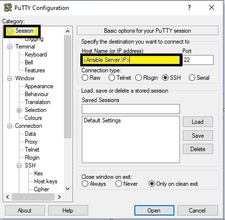
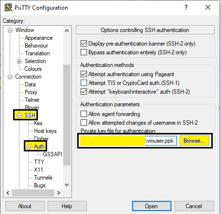
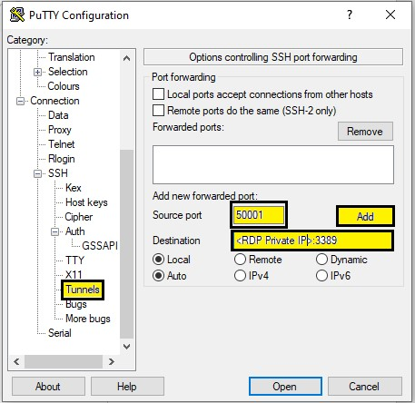
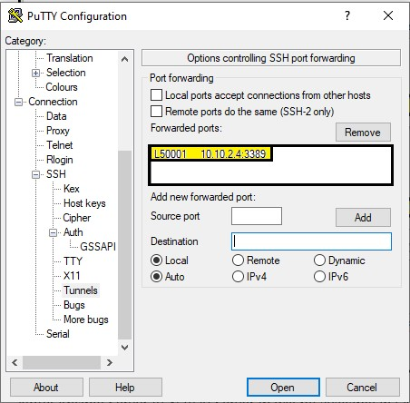
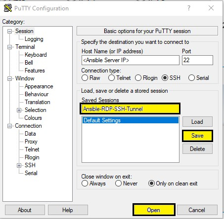
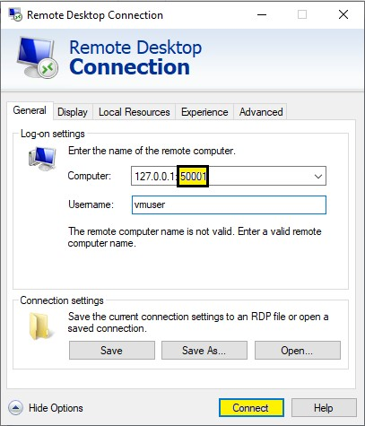

# SAS® QUICKSTART ON MICROSOFT® AZURE

[](https://portal.azure.com/#create/Microsoft.Template/uri/https%3A%2F%2Fraw.githubusercontent.com%2Fcorecompete%2Fsas94-viya%2Fdevelop_latest%2Fazuredeploy.json)
[](http://armviz.io/#/?load=https%3A%2F%2Fraw.githubusercontent.com%2Fcorecompete%2Fsas94-viya%2Fdevelop_latest%2Fazuredeploy.json)

This README for SAS® 9.4 & SAS® Viya® Quickstart Template for Azure is used to deploy the following SAS 9.4 and SAS Viya products on Microsoft® Azure cloud.

#### SAS® 9.4
* SAS Enterprise BI Server 9.4
* SAS Enterprise Miner 15.1
* SAS Enterprise Guide 8.2
* SAS Data Integration Server 9.4
* SAS Office Analytics 7.4
#### SAS Viya®
* SAS Visual Analytics 8.5 on Linux
* SAS Visual Statistics 8.5 on Linux
* SAS Visual Data Mining and Machine Learning 8.5 on Linux
* SAS Data Preparation 2.5

This Quickstart is a reference architecture for users who want to deploy the SAS 9.4 + Viya platform, using microservices and other cloud-friendly technologies. By deploying the SAS platform in Azure, you get SAS analytics, data visualization, and machine-learning capabilities in an Azure-validated environment. 

For assistance with SAS software, contact [SAS Technical Support](https://support.sas.com/en/technical-support.html). When you contact support, you will be required to provide information, such as your SAS site number, company name, email address, and phone number, that identifies you as a licensed SAS software customer.

## Contents
- [SAS® 9.4 and SAS Viya® Quickstart Template for Azure](#sas94-viya-quickstart-template-for-azure)
  - [Solution Summary](#solution-summary)
    - [Objective](#objective)
    - [Architecture Overview](#architecture-overview)
    - [Architecture Diagram](#architecture-diagram)
    - [SAS 9.4 Components](#sas-94-components)
    - [SAS Viya Components](#sas-viya-components)
  - [Cost and Licenses](#cost-and-license)
	- [SAS 9.4 Sizing](#sas-9.4-sizing)
	- [SAS Viya Sizing](#sas-viya-sizing)    
  - [Prerequisites](#prerequisites)
    - [Download SAS Software for 9.4 and Viya](#Download)
    - [Upload the SAS Software to an Azure File Share](#Upload-the-SAS-Software-to-an-Azure-File-Share)
  - [Best Practices When Deploying SAS Viya on Azure](#Best-Practices-When-Deploying-SAS-Viya-on-Azure)
  - [Deployment Steps](#Deployment-Steps)
  - [Additional Deployment Details](Additional-Deployment-Details)
    - [User Accounts](#user-accounts)
  - [Usage](#usage)
    - [Remote Desktop Login](#remote-desktop-login)
    - [Accessing SAS 9.4 Application](#Accessing-SAS-Application)
    - [Accessing SAS Viya Application](#accessing-SAS-Viya-Application)
    - [Review QuickStart Deployment Outputs](#review-quickstart-deployment-outputs)
  - [Troubleshooting](#troubleshooting)
    - [Important File and Folder Locations](#important-file-and-folder-locations)
    - [Review the Log Files](#review-the-log-files)
    - [Review SAS 9.4 Services Log Files](#Review-SAS94-Services-Log-Files)
    - [Review SAS Viya Services Log Files](#Review-SAS-Viya-Services-Log-Files)
    - [Restart SAS 9.4 Services](#Restart-SAS94-Services)
    - [Restart SAS Viya Services](#Restart-SAS-Viya-Services)
  - [Appendix](#appendix)
    - [Appendix A: SSH Tunneling](#Appendix-ssh-tunneling)
    - [Appendix B: Security Considerations](#Appendix-security-considerations)
  - [Additional Documentation](#additional-documentation)
  - [Send us Your Feedback](#send-us-your-feedback)
  - [Acknowledgements](#acknowledgements)


## Solution Summary
This QuickStart is intended to help SAS® customers deploy a cloud-native environment that provides both SAS® 9.4 platform and the SAS® Viya® 3.5 platform in an integrated environment. It is intended to provide an easy way for customers to get a comprehensive SAS environment, that will likely result in faster migrations and deployments into the Microsoft® Azure environment. The SAS ecosystem is deployed on the Azure platform, leveraging Azure native deployment approaches. As part of the deployment, you get all the powerful data management, analytics, and visualization capabilities of SAS, deployed on a high-performance infrastructure.


### Objective
The SAS 9.4 & Viya QuickStart for Azure will take a SAS provided license package for SAS 9.4, Viya and deploy a well-architected SAS platform into the customer’s Azure subscription. The deployment creates a virtual network and other required infrastructure. After the deployment process completes, you will have the necessary details for the endpoints and connection details to log in to the new SAS Ecosystem. By default, QuickStart deployments enable Transport Layer Security (TLS) for secure communication


### Architecture Overview
The QuickStart will setup the following environment on Microsoft Azure:
* A Virtual Network (VNet) configured with public and private subnets. This provides the network infrastructure for your SAS 94 and SAS Viya deployments.
* In the public subnet, a Linux bastion host acting as an Ansible Controller Host.
* In the private subnet, a Remote Desktop instance acting as a Client Machine.
* In the Application subnets (private subnet), Virtual Machines for:
	* **SAS 9.4**  – Metadata, Compute, and Mid-Tier Servers
	* **SAS Viya** – Microservices, SPRE, Cloud Analytic Services (CAS) Controller, and CAS Workers Servers
* Disks required for SAS Binaries, Configuration, and Data will be provisioned using Premium Disks in Azure.
* Security groups for Virtual Machines and Subnets.
* Accelerated Networking is enabled on all the network interfaces.
* All the servers are placed in the same proximity placement group.


### Architecture Diagram


#### SAS 9.4 Components
SAS® 9.4 QuickStart bootstraps the infrastructure for a 3 machine SAS 9.4 environment consisting of:

 * 1 x SAS Metadata Server
 * 1 x SAS Compute Server
 * 1 x SAS Mid-Tier Server
 * 1 x Windows RDP Machine (For accessing thick clients)

It also deploys the SAS Software stack in the machines and performs post-installation steps to validate and secure the mid-tier for encrypted communication. The template will also install SAS desktop clients like SAS® Enterprise Guide®, SAS® Enterprise Miner™, SAS® Data Integration Studio, and SAS® Management Console on the Windows RDP Machine.

#### SAS Viya Components
SAS Viya Quick Start bootstraps the infrastructure required for SAS Viya MPP system consisting of: 

 * 1 x Ansible Controller (acts as Bastion Host)
 * 1 x Microservices
 * 1 x CAS Controller
 * n x CAS Worker Nodes (Number to be specified by user while launching Quick Start)

The template will run with pre-requisites to install SAS Viya on these servers and then deploy SAS Viya on the system.

## Cost & Licenses
The user is responsible for the cost of the Azure Cloud services used while running this QuickStart deployment. There is no additional cost for using the QuickStart. You will need a SAS license (emailed from SAS for SAS 9.4 and SAS Viya) to launch this QuickStart. Your SAS account team can advise on the appropriate software licensing and sizing to meet the workload and performance needs. SAS software is typically licensed on maximum number of physical cores for the computational engine.

In Azure, instance sizes are based on virtual CPUs (vcpus) which equates to 2 vcpus per physical core. We provide recommended instance types and sizes, based on physical cores, as a starting point for this deployment. It is important to use server types that support Accelerated Networking and Premium Storage features. You may choose to use larger instances as recommended by SAS sizing guidelines, but we recommend using the instance series noted.


### SAS 9.4 Sizing
Here are some recommended Machine Types for SAS 9.4 environment:

For **Metadata Server**, We recommend ** Standard_D8s_v3**

For **Compute Server**, choose from this list, based on the number of physical cores you have licensed:

| Licensed Cores  |	Virtual Machine   | SKU	Memory (RAM)  |	Temporary Storage |
| --------------- | ----------------  | ----------------- | ----------------- |
|   4	            |  Standard_E8s_v3  |	  64 GB           |	 128 GB           | 
|   8	            |  Standard_E16s_v3 |	  128 GB          |  256 GB           |
|   16	          |  Standard_E32s_v3 |	  256 GB          |	 512 GB           |
|   32            |  Standard_E64s_v3 |   432 GB          |  864 GB           |

For the **Mid-Tier server**, Start with 4 physical cores with sufficient memory (minimum 40 GB) to support Web Application JVMs, We recommend: ** Standard_E8s_v3, or Standard_D8s_v3**.


### SAS Viya Sizing
For SAS Viya, here are the recommendations:

**Microservices Server:**

Choose a machine with minimum 4 physical cores and 60 GB memory. The recommended instance type is:
 * Standard_E8s_v3

**SPRE Server:**

SPRE Server is responsible for the computational actions in the Viya environment. Choose a machine with a minimum of 8 virtual cores. In general, you should choose the same instance type as you use for the CAS worker below. The recommended instance types are:

|  VCPUS 	  |	Virtual Machine  | SKU	Memory (RAM)  |	Temporary Storage |
| --------------- | ---------------- | ------------------ | ----------------- |
|   8	          |  Standard_E8s_v3 |	64 GB             |  128 GB           |
|   16	          |  Standard_E16s_v3 |	128 GB            |  256 GB           |
|   32            |  Standard_E32s_v3 |  256 GB           |  512 GB           |
|   8             |  Standard_D8s_v3 | 32 GB             |  64 GB            |
|   16             |  Standard_D16s_v3 | 64 GB             |  128 GB           |
|   32            |  Standard_DS32_v3 | 128 GB            |  256 GB           |


**CAS Controller and Workers Nodes:**

For **CAS Controller Server & Workes **, choose from this list for:

|  VCPUS 	  |	Virtual Machine  | SKU	Memory (RAM)  |	Temporary Storage |
| --------------- | ---------------- | ------------------ | ----------------- |
|   8	          |  Standard_E8s_v3 |	64 GB             |  128 GB           |
|   16	          |  Standard_E16s_v3 |	128 GB            |  256 GB           |
|   32            |  Standard_E32s_v3 |  256 GB           |  512 GB           |


## Prerequisites
Before deploying SAS Quickstart Template for Azure, you must have the following:

* An Azure user account with Owner permission or Contributor Role and custom roles with below permissions:
    * Microsoft.Authorization/roleAssignments/write
    * */read
    * Microsoft.Authorization/*/read
    * Microsoft.KeyVault/locations/*/read
    * Microsoft.KeyVault/vaults/*/read
* Sufficient quota for the number of Cores in Azure Account to accommodate all the servers in the SAS 9.4 and SAS Viya ecosystem. Please check your [subscription limits](https://docs.microsoft.com/en-us/answers/questions/10982/where-do-i-see-the-current-azure-vm-quota-limits-f.html) before launching the QuickStart.  You can request an increase in standard vCPU quota limits per VM series from [Microsoft support](https://docs.microsoft.com/en-us/azure/azure-portal/supportability/per-vm-quota-requests). 
* A resource group that does not already contain a Quickstart deployment. For more information, see [Resource groups](https://docs.microsoft.com/en-us/azure/azure-resource-manager/resource-group-overview#resource-groups).
* All the Server types you select must support [Accelerated Networking](https://docs.microsoft.com/en-us/azure/virtual-network/create-vm-accelerated-networking-cli) and [Premium Storage](https://docs.microsoft.com/en-us/azure/virtual-machines/disks-types#premium-ssd)
* You would need AzureKeyVault Owner ID and SSH Public key to be provided in the parameters at the time of deployment. Follow the instructions on 
    * To Get the AzureKeyVault OwnerID, run the below command in the Azure Powershell.
    
    	`Get-AzADUser -UserPrincipalName user@domain.com | grep Id`
	
    * How to [Generate the SSH Public key](https://www.ssh.com/ssh/putty/windows/puttygen)
* A SAS Software Order Confirmation Email that contains supported Quickstart products.
    The license file {emailed from SAS as `SAS_Viya_deployment_data.zip`} which describes your SAS Viya Software Order and SAS 9.4 software order details required to download the sasdepot.

### Download SAS Software for 9.4 and Viya

* Follow the SAS Instruction to [download the SAS 9.4 Software](https://documentation.sas.com/?docsetId=biig&docsetTarget=n03005intelplatform00install.htm&docsetVersion=9.4&locale=en)
* Follow the SAS Instruction to Create the [SAS Viya Mirror Repository](https://documentation.sas.com/?docsetId=dplyml0phy0lax&docsetTarget=p1ilrw734naazfn119i2rqik91r0.htm&docsetVersion=3.5&locale=en)
	Download SAS Mirror Manager from the [SAS Mirror Manager download site](https://support.sas.com/en/documentation/install-center/viya/deployment-tools/35/mirror-manager.html) to the machine where you want to create your mirror repository and uncompress the downloaded file.
* Run the command to Mirror the SAS viya repository:

		mirrormgr  mirror  --deployment-data  <path-to-SAS_Viya_deployment_data>.zip --path <location-of-mirror-repository> --log-file mirrormgr.log --platform 64-redhat-linux-6  --latest
 
### Upload the SAS Software to an Azure File Share
The QuickStart deployment requires parameters related to the license file and SAS Depot Location, which will be available once you upload the SAS 9.4 and Viya Depot and License files to Azure File Share.

#### Creating Azure Premium FileShare
* Create Azure File Share with premium options. Follow the   Microsoft Azure instructions to "[Create a Premium File Share](https://docs.microsoft.com/en-us/azure/storage/files/storage-how-to-create-premium-fileshare?tabs=azure-portal)"
* Once the Azure Premium FileShare is created, create two new directories/folders for SAS 9.4 and SAS Viya - **"sasdepot" & "viyarepo"**
* Instructions to Mount FileShare on [Windows](https://docs.microsoft.com/en-us/azure/storage/files/storage-how-to-use-files-windows), [Mac](https://docs.microsoft.com/en-us/azure/storage/files/storage-how-to-use-files-mac) and [Linux](https://docs.microsoft.com/en-us/azure/storage/files/storage-how-to-use-files-linux).

#### SAS Software Upload
* Once you SAS Software download is complete following the above instructions, copy/upload the complete SAS 9.4 Software depot to "sasdepot" directory. 
* For Viya, copy/upload the downloaded mirror to "viyarepo" folder on fileshare and also upload the **SAS_Viya_deployment_data.zip** {emailed from SAS} to the same "viyarepo" folder where the viya software is located
    
#### SAS 9.4 License File
* Check your SAS 9.4 license files under the **sid_files** directory in the SASDepot folder to see if the necessary SAS 9.4 license files are present. If not, please upload the SAS 9.4 License files into that directory (e.g. /storageaccountName/filesharename/sasdepot/sid_files/SAS94_xxxxxx_xxxxxxxx_LINUX_X86-64.txt). The license file will be named like SAS94_xxxxxx_xxxxxxxx_LINUX_X86-64.txt.

**Note:** You might require values for some of the parameters that you need to provide while deploying this SAS QuickStart on Azure such as Storage Account Name, File Share Name, sasdepot folder, viyarepo folder, SAS Client license file, SAS Server license file, Storage Account Key
 
 **Get Storage Account Access key** - Follow the Microsoft Azure instructions to "[view storage account access key](https://docs.microsoft.com/en-us/azure/storage/common/storage-account-keys-manage?tabs=azure-portal)"

 
## Best Practices When Deploying SAS Viya on Azure
We recommend the following as best practices:
* Create a separate resource group for each Quickstart deployment. For more information, see [Resource groups](https://docs.microsoft.com/en-us/azure/azure-resource-manager/resource-group-overview#resource-groups).
* In resource groups that contain a Quickstart deployment, include only the Quickstart deployment in the resource group to facilitate the deletion of the deployment as a unit.

## Deployment Steps
You can click the "Deploy to Azure" button at the beginning of this document or follow the instructions for a command-line (CLI) deployment using the scripts in the root of this repository.

The deployment takes between 1 and 2 hours, depending on the quantity of software licensed.

Below is the list of the Parameters that would require to be filled during the deployment of this SAS QuikStart.

|   Name of the Parameter           |   Default	        |   Description                   |
| -------------------------         | ----------------- | ------------------------------- |
|   Storage Account Name	        |   Required Input	|   The storage account name in Azure where SAS depot has been uploaded. |
|   Storage Account Key	            |   Required Input	|   Storage Account Key for the respective Storage Account. |
|   File Share Name	                |   Required Input	|   Name of the file share in which SAS Depot and Mirror repo have been uploaded. |
|   SAS Depot Folder	            |   Required Input	|   Directory Name in the File Share where SAS Depot has been placed. |
|   Viya Repo Folder	            |   Required Input  |	Directory name in the File share where Mirror Repo for SAS Viya has been placed.    |
|   SAS Server license file	        |   Required Input	|   Name of the SAS Server License file (SAS94_xxxxxx_xxxxxxxx_LINUX_X86-64.txt). Place the SAS Server License files into that directory. Make sure this file contains the licenses of all SAS94 Software Products for Linux.   |
|   SAS External Password	        |   Required Input	|   Password for all external accounts in SAS Servers for SSH and SAS applications login. |
|   SAS Internal Password	        |   Required Input	|   This is an internal password in SAS Metadata and Web Infrastructure Platform database. The accounts with this password will have elevated privileges in the SAS estate. |
|   Subscription	                |   Required Input          |	Choose the Azure Subscription from which you wish to launch the resources for the QuickStart. |
|   Resource Group Name	            |   Required Input	        |   Create New Resource Group or choose an existing Resource to launch the QuickStart resources. It is recommended to create a new resource group for each QuickStart deployment to maintain the resources. |
|   Resource Group Location         |	Required Input	        |   Choose an appropriate location where you would like to launch your Azure resources. Please note, the Storage account with SAS Depot and Mirror Repo should exist in the same Azure region. |
|   SAS Application Name	        |   Required Input<br>String Input<br>No spaces<br>Length – Minimum 2 & Maximum 5.	|   Choose an Application name to the group and name your resources. We recommend using your company name or project name.  This tag will be used as a prefix for the hostname of the SAS servers and Azure resources. |
|   Key Vault Owner ID              |	Required Input	        |   Key Vault Owner Object ID Specifies the object ID of a user, service principal in the Azure Active Directory tenant. Obtain it by using Get-AzADUser or Get-AzADServicePrincipal cmdlets. e.g., In Azure Cloud PowerShell type PS>`Get-AzADUser -UserPrincipalName user@domain.com | grep Id`. It is recommended to give the user object id of whomever is deploying the QuickStart. |
|   SSH Public key	                |   Required Input	        |   The SSH public key that will be added to all the servers.   |
|   Location	                    |   [resourceGroup().location]	|   Azure Resources location, where all the SAS 9.4 and Viya resources should be created. e.g., servers, disks, IP's etc. The default value will pick up the same location as where the resource group is created. |
|   _artifacts Location	            |   SAS 9.4 and SAS Viya: https://raw.githubusercontent.com/Azure/azure-quickstart-templates/master/sas9.4-viya/  | URL of the public repository where all the templates and dependant artifacts are located in. |
|   SAS9.4 Data Storage – SAS Data	 |   Default:100<br>Min: 100<br>Max:32767 |	Storage Volume Size for SAS 9.4 Compute Server.   |
|   SAS Viya Data Storage	        |   Default:100<br>Min: 100<br>Max:32767 |	Storage Volume Size for SAS Viya Cas Server.
|   Admin Ingress Location	        |   Required Input	|   The CIDR block that can access the Ansible Controller/Bastion Host and Remote Desktop machine. We recommend that you set this value to a trusted IP range. For example, you might want to grant access only to your corporate network. |
|   VNet CIDR	                    |   Default: 10.10.0.0/16   |	The CIDR block for the Virtual Network.     |
|   Vnet Public Subnet CIDR	        |   Default: 10.10.1.0/24	|   The CIDR block for the Ansible Controller/Bastion Host Public Subnet. |
|   SAS9.4 Private Subnet CIDR	    |   Default: 10.10.2.0/24	|   The CIDR block for the first private subnet where the SAS 9.4 and RDP machines will be deployed.  |
|   Viya Private Subnet CIDR	    |   Default: 10.10.3.0/24	    |   The CIDR block for the second private subnet where the SAS Viya machines will be deployed.      |
|   SAS9.4 Meta VM Size	            |   Required Input<br>Default: Standard_D8s_v3	|   VM Type for SAS Metadata Server.    |
|   SAS9.4 Mid VM Size	            |   Required Input<br>Default: Standard_E8s_v3  |	VM Type for SAS Mid VM Server.      |
|   SAS9.4 Compute VM Size	        |   Required Input<br>Default: Standard_E8s_v3	|   VM Type for SAS Compute Server.     |
|   Viya Microservices VM Size	    |   Required Input<br>Default: Standard_E8s_v3	    |   VM Type for SAS Viya Microservices Server.  |
|   Viya SPRE VM Size	            |   Required Input<br>Default: Standard_E8s_v3	    |   VM Type for SAS Viya SPRE Server.       |
|   Viya CAS Controller VM Size	    |   Required Input<br>Default: Standard_E8s_v3	    |   VM Type for SAS Viya CAS Controller Server. |
|   Viya CAS Worker VM Size	        |   Required Input<br>Default: Standard_E8s_v3	    |   VM Type for SAS Viya CAS Worker Nodes.  |
|   Number of Viya CAS Nodes	    |   Required Input<br>Default: 1<br>Min: 1<br>Max: 100 | Number of CAS Worker Nodes required for the deployment.  |


## Additional Deployment Details

### User Accounts
The *vmuser* host operating system account is created during deployment. Use this account to log in via SSH to any of the machines. 

SAS External Users such sasinst is used for SAS 9.4 Installation. Create SAS Account to access the application once the deployment is finished.

SAS Users for Viya such sas and cas are created during the deployment. These are the default user accounts for logging in SAS Viya. You cannot directly log on to the host operationg system with these accounts. 

SAS Viya boot user account *sasboot* can be used to login to the application. You will have the URL to reset the password of *sasboot* useraccount from the outputs section on the successful deployment of the Quickstart. 

**Note:**You need to bind your servers and SAS Viya Application with an LDAP Server.


## Usage

### Remote Desktop Login
1.	SSH to the Ansible bastion host using the *vmuser*.
```
ssh vmuser@<AnsibleControllerIP>
```
2.  From the Azure Bastion Server, connect to any of the VM instances as vmuser. Passwordless SSH has been set up by default to all the servers from Ansible Controller VM.
```
ssh root@<anyvmserver>
```
3.  Create an RDP tunnel through the bastion host. See the Appendix section for Tunneling instructions.
4.	RDP to the Windows Server using the user(vmuser) and password (SAS External Password parameter value).


### Accessing SAS 9.4 Applicaiton
The SAS 9.4 clients such as **SAS Enterprise Guide, DI Studio, SAS Enterprise Miner,** and **SAS Management Console** are installed on the Windows RDP. Log in to these applications using the sasdemo user. The password would be the one you specified in the template under the “SAS External Password parameter value.” 


The SAS Viya Web applications can be accessed through the Web Brower on the RDP and directly through your browser via SSH Tunnel. See the Appendix section for Tunneling instructions. 


### Review QuickStart Deployment Outputs
The following outputs will be provided after the successful execution of the SAS QuickStart Template.

|   Outputs          |   	Default	            |   Description         |                   
| ----------------     | ------------------------------- | ------------------------- |
|   Bastion Host Connection String	|   `vmuser@x.x.x.x`      |	Use this connection string to connect to Bastion Host/Ansible Controller form your local machine. |
|   RDP Server IP	        |   x.x.x.x	                |   You can use Remote Desktop Connection from your local system to this IP Address through SSH Tunneling to access the RDP server from where SAS Clients and Web Applications can be accessed. |
|   SAS Metadata Connection String |	`<sasmetahostname> 8561`	|   Use this connection string (Hostname and Port Number) in SAS Thick Clients like EG, DI Studio, SMC to connect to the Metadata Server. |
|   SAS 9.4 Install User	|   sasinst	    |   The account is used to install and configure SAS 9.4 Applications. The password for this account will be the one you chose in the deployment under “SAS External Password.”  |
|   SASStudio MidTier   |   	`https://<mid-tier-hostname>:8343/SASStudio`	|   SAS Studio URL – Web version of Enterprise Guide.   |
|   SAS 9.4 Logon     |   	`https://<mid-tier-hostname>:8343/SASLogon`	|   SAS Application Logon URL.  |
|   Viya SASStudio  |   	`https://<microservices>/SASStudioV`	|   URL to access Viya SAS Studio.  |   
|   SAS Viya Admin Password Reset URL	|   `https://<microservices>/SASLogon/reset_password?code=<token>`    |	URL to reset the sasboot password.|
|   Viya SASDrive	|   `https://<microservices>/SASDrive`	|   URL to access SAS Environment Manager. |


## Troubleshooting
If your deployment fails:
* Check to ensure that all the parameters values that are provided are correct and valid.
* Verify the downloaded SASDepot and Viya Mirro repositories are correct.
* Verify the Premium FileShare created in the storage account is accessible to all virtual machines.
* Review the failed deployment steps and see ["Deployment errors"](https://docs.microsoft.com/en-us/azure/azure-resource-manager/resource-manager-common-deployment-errors#deployment-errors) in the Azure troubleshooting documentation.
*   In general, issues that occur in the primary deployment but do not originate from a sub-deployment are platform issues such as the inability to obtain sufficient resources in a timely manner. In these cases, you must redeploy your software. When the deployment is run via the CLI, the primary deployment is called "azure-deploy". When the deployment is run via the UI template, the primary deployment is called "Microsoft.Template". The names of sub-deployments usually begin with "Phase#".


### Important File and Folder Locations
Here are some of the Key Locations and files that are useful for troubleshooting and performing any maintenance tasks:
#### SAS 9.4 Environment
|Directory Name |	Description/Purpose |	Location |
| ------------- | ---------------------------- | ------------------------- |
| RESPONSE FILES	| Location of Response files involved in SAS Deployment.  |	/opt/sas/resources/responsefiles |
| SAS DEPLOYMENT	| Location of SAS deployment. SAS Home and SAS Config directories reside here. |	/opt/sas/ | 
| SAS DEPOT	| Location of SAS Depot. |	/sasdepot (mounted as Azure file share in all Servers) |
| SAS DATA	| Location of SAS data, projects, source code, and applications. |	/sasdata |
| SAS WORK/SASUTIL |	Location of SAS workspace and temporary scratch area. This area will predominantly be used for transient and volatile data and technically emptied after the completion of job processing. |	**Compute Server:** /saswork |
| SAS BACKUP |	Location for SAS Backup and Recovery Tool backup vault. |	/opt/sas/backups |
| DEPLOYMENT LOGS	| Location for Deployment Logs. Contains the logs for all phase-wise execution of Pre-Reqs, Install, Config, and Post Deployment scripts. |	/var/log/sas/install/ |
#### SAS Viya Environment
| Directory Name	|   Description/Purpose	          |   Location/Size           |
| -------------     | ------------------------------- | ------------------------- |
| PLAYBOOKS         |	Location of Ansible playbooks. The Ansible controller contains the main SAS deployment playbook, whereas the rest of the servers contain the Viya-ARK playbook required for Pre and Post Deployment tasks. |  **Ansible controller:** /sas/install/sas_viya_playbook    **MicroServices, SPRE, CAS Servers, worker nodes:** /opt/viya-ark |
| SASDEPLOYMENT	    | Location of SAS deployment.	| /opt/sas  |
|   SASREPO	    |   Location of a local mirror of the SAS repository (if a mirror is used).	|   **Ansible VM:** /sasdepot/viyarepo *(mounted shared directory on an Azure file share)*|
|SASDATA	    |Location of SAS data, projects, source code, and applications.	|   **CASController VM:** /sasdata |
|SASWORK/SASUTIL    |	Location of SAS workspace and temporary scratch area. This area will predominantly be used for transient and volatile data and technically emptied after the completion of job processing. | **SPRE VM:** /saswork |
| SASCACHE  |	Location of CAS disk cache. |	**CAS Servers:** /cascache |
| SASLOGS   |	Location of the SAS application log files.  |	/opt/sas/viya/config/var/log (also at /var/log/sas/viya)    |
|SASBACKUP  |	Location for SAS Backup and Recovery Tool backup vault.	    | /backup   |
|   DEPLOYMENTLOGS  |	Location for Deployment Logs. Contains the logs for all phase-wise execution of Pre-Reqs, Install, Config, and Post Deployment scripts. |	/var/logs/sas/install  *or* /sas/install/sas_viya_playbook/deployment.log |


### Review the Log Files
Ansible is the primary virtual machine that is used for the installation. Most of the deployment log files reside on the Ansible virtual machine.
#### Ansible Server Log Files:
The /var/log/sas/install directory is the primary deployment log directory. Other logs follow:
* runAnsiblePhase*.log files: logs that are produced by the extensions 
* /etc/facters/facts.d/variables.txt: a listing of the parameters supplied to the start scripts.


#### Review SAS 9.4 Services Log Files
* The SAS 9.4 Services Log files are in this parent directory: /opt/sas/config/Lev1.
* The location for each SAS 9.4 Service can be computed from [here](https://documentation.sas.com/?docsetId=bisag&docsetTarget=p1ausbmrrybuynn1xnxb6jmdfarz.htm&docsetVersion=9.4&locale=en)
* Refer to this SAS Note for locating SAS Log files in SAS 9.4 environment: https://support.sas.com/kb/55/426.html


#### Review SAS Viya Services Log Files
* /var/log/sas: parent folder for SAS Viya application logs. If there is a startup issue after installation, the information in these logs might be helpful.


### Restart SAS 9.4 Services
SAS 9.4 Services need to be stopped and started in a particular order to avoid any consequences or issues while accessing the application. 
##### Stop/Start SAS Services
The services need to be stopped/restarted on mid-tier server, compute server, and metadata server in the order using the below command
```
    /opt/sas/config/Lev1/sas.services stop
    /opt/sas/config/Lev1/sas.services restart
```
If the services are stopped, then they need to be started on the metadata server, compute server, and mid-tier server in the order using the below command
```
    /opt/sas/config/Lev1/sas.services start
```

### Restart SAS Viya Services
While all the services can be started on each box independently, the Viya-Ark toolkit provides an efficient way to restart all the services across all the boxes from the Ansible controller.

#### Checking the status of the services through Viya-Ark
Viya-Ark can check the status of the services by issuing the following commands as the vmuser on the Ansible controller:
```
cd /sas/install/ansible/sas_viya_playbook/
ansible-playbook viya-ark/playbooks/viya-mmsu/viya-services-status.yml
```

#### Restarting the services through Viya-Ark
Viya-Ark can restart all of the services by issuing the following commands as the vmuser on the Ansible controller:
```
cd /sas/install/ansible/sas_viya_playbook/
ansible-playbook viya-ark/playbooks/viya-mmsu/viya-services-restart.yml -e enable_stray_cleanup=true
```


## Appendix

#### Configure PAM for SAS Studio
Because SAS Studio does not use the SAS Logon Manager, it has different requirements for integration with an LDAP system. SAS Studio manages authentication through a pluggable authentication module (PAM). You can use System Security Services Daemon (SSSD) to integrate the PAM configuration on your services machine with your LDAP system. To access SAS Studio, the following conditions must be met:


### Appendix A: SSH Tunneling
Port forwarding via SSH (SSH tunneling) creates a secure connection between your local computer and a remote machine through which services can be accessed.
##### Step 1
In your PuTTY configuration, configure the Public IP address and Port of your Ansible-Controller/Bastion Host Server. Ansible Controller IP and user details will be available in deployment output in the Azure portal



##### Step 2: 
In the SSH section, browse and select the vmuser private key.




##### Step 3: 
In the SSH section, select the Tunnels option and configure the RDP server private IP (ARM templates outputs) with 3389 port and source port as 50001(Random port in between 50001-60001) and click on Add.



##### Step 4: 
Make sure the entry has been correctly added, as shown below:



##### Step 5: 
Once all the configuration is updated, save the configuration and click on Open.



##### Step 6: 
Open an RDP connection and enter your local IP (127.0.0.1), along with the local port (i.e., Step3 Source Port) in PuTTY. The username will be (vmuser) and the password (SAS External Password Parameter Value).




## Appendix B: Security Considerations
#### Network Security Groups
SAS Quickstart for Azure uses the following network security groups to control access to the servers from sources outside the virtual network. All server to server communication between subnets in the SAS  virtual network is permitted.

| Name          | Ingress Rules | Egress Rules  | Servers/Subnets | Notes         |
| ------------- | ------------- | ------------- | -------------   | ------------- |
| Public Subnet NSG | Allow port 22/tcp from CIDR prefix specified in the "Admin Ingress Location" parameter |	Allow All | Public Subnet |	Only allowed external connections can be directly made to the servers in public Subnet. |
| Private Subnet NSG |	Deny All |	Allow All | Private Subnet | No external connections can be directly made to the servers in private Subnet. |
| Ansible NSG  | Allow port 22/tcp from CIDR prefix specified in the "Admin Ingress Location" parameter. Deny all others.| Allow All  | Ansible |Ansible/bastion server can be connected to through SSH only.   |
| RDP NSG  |  Deny all | Allow All  |  Windows RDP | No external connections can be directly made to the server.   |
| Metadata NSG  |  Deny all | Allow All  | SAS 9.4 Metadata | No external connections can be directly made to the server.   |
| Compute NSG  |  Deny all | Allow All  |  SAS 9.4 Compute | No external connections can be directly made to the server.   |
| Mid NSG  |  Deny all | Allow All  |  SAS 9.4 Mid-tier | No external connections can be directly made to the server.   |
| Microservices NSG  |  Deny all | Allow All  |  SAS Viya Microservices | No external connections can be directly made to the server.   |
| Spre NSG  |  Deny all | Allow All  |  SAS Viya Spre | No external connections can be directly made to the server.   |
| CAS Controller NSG  |  Deny all | Allow All  |  SAS Viya CasController | No external connections can be directly made to the server.   |
| CASWorker NSG  |  Deny all | Allow All  |  SAS Viya CasWorker | No external connections can be directly made to the server.   |


## Additional Documentation
**QuickStart Git Repository:**
[SAS 9.4 and Viya](https://github.com/corecompete/sas94-viya)

**SAS 9.4 Documentation:** https://support.sas.com/documentation/94/

**SAS Viya Documentation:**  https://support.sas.com/en/software/sas-viya.html#documentation

**Azure Well Architected Framework:** https://docs.microsoft.com/en-us/azure/architecture/framework/


## Send us Your Feedback
Please reach out to **Diane Hatcher** (diane.hatcher@corecompete.com) and **Rohit Shetty** (rohit.shetty@corecompete.com) for any feedback or questions on the QuickStart.


## Acknowledgements
We are thankful to **Intel Corporation** for sponsoring this development effort. We are thankful to **SAS Institute** for supporting this effort and including providing technical guidance and validation.

```
Tags: SAS, SAS 9.4, Viya, SAS Viya, Core Compete, corecompete, SAS 9.4 and Viya
```