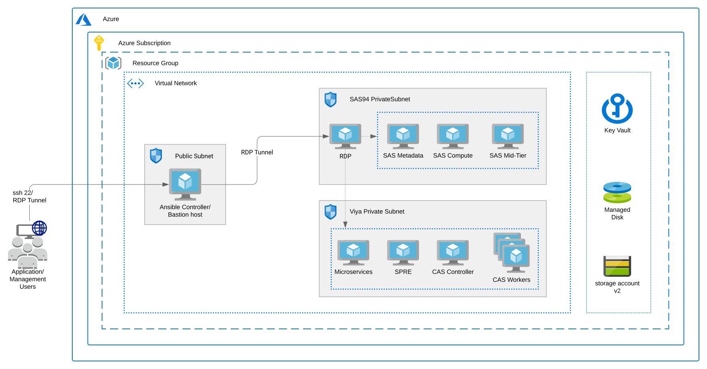

# SAS 94 + Viya Quickstart Template for Azure
This README for  SAS 94 + Viya Quickstart Template for Azure is used to deploy the following SAS 94 + Viya products in the Azure cloud. Refer [SAS QuickStart Deployment Guide](https://github.com/corecompete/sas94ng-viya/blob/master/SAS-Quick-Start-on-Azure_v1.pdf) for detailed steps.

 

## SAS 9 Components
* SAS Enterprise BI Server 94
* SAS Enterprise Miner 15.1
* SAS Enterprise Guide 8.2
* SAS Data Integration Server 9.4
* SAS Office Analytics 7.4
## SAS Viya
* SAS Visual Analytics 8.5 on Linux
* SAS Visual Statistics 8.5 on Linux
* SAS Visual Data Mining and Machine Learning 8.5 on Linux
* SAS Data Preparation 2.5

This Quickstart is a reference architecture for users who want to deploy the SAS 94 + Viya platform, using microservices and other cloud-friendly technologies. By deploying the SAS platform in Azure, you get SAS analytics, data visualization, and machine-learning capabilities in an Azure-validated environment. 

## Contents
- [SAS 94 + Viya Quickstart Template for Azure](#sas94-viya-quickstart-template-for-azure)
  - [Solution Summary](#Summary)
    - [Objective](#Objective)
    - [Architecture Overview](#Overview)
    - [Architecture Diagram](#Architecture)
  - [Pre-Requisites](#prerequisites)
    - [Download SAS Software for 9.4 and Viya](#Download)
    - [Upload the SAS Software to an Azure File Share](#Upload)
    - [Best Practices When Deploying SAS Viya on Azure](#Best)
  - [Deployment Steps](#Deploy)

## Solution Summary
This QuickStart is intended to help SAS customers deploy a cloud-native environment that provides both SAS 9.4 platform and the SAS Viya 3.5 platform in an integrated environment. It is intended to provide an easy way for customers to get a comprehensive SAS environment, that will likely result in faster migrations and deployments into the Azure environment. The SAS ecosystem is deployed on the Azure platform, leveraging Azure native deployment approaches. As part of the deployment, you get all the powerful data management, analytics, and visualization capabilities of SAS, deployed on a high-performance infrastructure.

### Objective
The SAS 9 & Viya QuickStart for Azure will take a SAS provided license package for SAS 9, Viya and deploy a well-architected SAS platform into the customer’s Azure subscription. The deployment creates a virtual network and other required infrastructure. After the deployment process completes, you will have the necessary details for the endpoints and connection details to log in to the new SAS Ecosystem. By default, QuickStart deployments enable Transport Layer Security (TLS) for secure communication

### Architecture Overview
The QuickStart will setup the following environment on Microsoft Azure:
* A Virtual Network (VNet) configured with public and private subnets. This provides the network infrastructure for your SAS 94 and SAS Viya deployments.
* In the public subnet, a Linux bastion host acting as an Ansible Controller Host.
* In the private subnet, a Remote Desktop instance acting as a Client Machine.
* In the Application subnets (private subnet), Virtual Machines for:
	* SAS 94 – Metadata, Compute and Mid-Tier
	* SAS Viya – Microservices, SPRE, CAS Controller and CAS Workers
* Disks required for SAS Binaries, Configuration, and Data will be provisioned using Premium Disks in Azure.
* Security groups for Virtual Machines and Subnets.

### Architecture Diagram

## Prerequisites
Before deploying SAS Quickstart Template for Azure, you must have the following:
* Azure user account with Contributor and Admin Roles
* Sufficient quota of at least 56 Cores based on licensed core for MPP environments ( SAS 9.4 and Viya)
* A SAS Software Order Confirmation Email that contains supported Quickstart products:
 
	The license file {emailed from SAS as SAS_Viya_deployment_data.zip} which describes your SAS Software Order.
	SAS 9.4 software order details required to download the sasdepot.
 
* A resource group that does not already contain a Quickstart deployment. For more information, see [Resource groups](https://docs.microsoft.com/en-us/azure/azure-resource-manager/resource-group-overview#resource-groups).
* Refer [SAS QuickStart Deployment Guide](https://github.com/corecompete/sas94ng-viya/blob/master/SAS-Quick-Start-on-Azure_v1.pdf) for more information.

### Download SAS Software for 9.4 and Viya
* Follow the SAS Instruction to [download the SAS 9.4 Software](https://documentation.sas.com/?docsetId=biig&docsetTarget=n03005intelplatform00install.htm&docsetVersion=9.4&locale=en).
* Follow the SAS Instruction to Create the [SAS Viya Mirror Repository](https://documentation.sas.com/?docsetId=dplyml0phy0lax&docsetTarget=p1ilrw734naazfn119i2rqik91r0.htm&docsetVersion=3.5&locale=en).

	Download SAS Mirror Manager from the [SAS Mirror Manager download site](https://support.sas.com/en/documentation/install-center/viya/deployment-tools/35/mirror-manager.html) to the machine where you want to create your mirror repository and uncompress the downloaded file.

* Run the command to Mirror the SAS viya repository:

		mirrormgr  mirror  --deployment-data  <path-to-SAS_Viya_deployment_data>.zip --path <location-of-mirror-repository> --log-file mirrormgr.log --platform 64-redhat-linux-6  --latest
 
* Refer [SAS QuickStart Deployment Guide](https://github.com/corecompete/sas94ng-viya/blob/master/SAS-Quick-Start-on-Azure_v1.pdf) for more information.

### Upload the SAS Software to an Azure File Share
* Create Azure File Share with premium options. Follow the   Microsoft Azure instructions to "[Create a Premium File Share](https://docs.microsoft.com/en-us/azure/storage/files/storage-how-to-create-premium-fileshare?tabs=azure-portal)"
* Upload the SAS_Viya_deployment_data.zip {emailed from SAS} to viyarepo folder where the software for viya is located. Instructions to Mount on [windows](https://docs.microsoft.com/en-us/azure/storage/files/storage-how-to-use-files-windows), [Mac](https://docs.microsoft.com/en-us/azure/storage/files/storage-how-to-use-files-mac) and [Linux](https://docs.microsoft.com/en-us/azure/storage/files/storage-how-to-use-files-linux).
* The QuickStart deployment requires below parameters.storage account name, file share name, sasdepot folder, viyarepo folder, SAS Client license file, SAS Server license file, storage account key
* Create two directories for SAS 9.4 and SAS Viya in the File share(eg: sasdepot and viyarepo)
* Upload the SAS Software(sasdepot) to sasdepot folder. 
* Get Storage Account Access key. Follow the Microsoft Azure instructions to "[view storage account access key](https://docs.microsoft.com/en-us/azure/storage/common/storage-account-keys-manage?tabs=azure-portal)"
* Refer [SAS QuickStart Deployment Guide](https://github.com/corecompete/sas94ng-viya/blob/master/SAS-Quick-Start-on-Azure_v1.pdf) for more information.
 

### Best Practices When Deploying SAS Viya on Azure
We recommend the following as best practices:
* Create a separate resource group for each Quickstart deployment. For more information, see [Resource groups](https://docs.microsoft.com/en-us/azure/azure-resource-manager/resource-group-overview#resource-groups).
* In resource groups that contain a Quickstart deployment, include only the Quickstart deployment in the resource group to facilitate the deletion of the deployment as a unit.

## Deployment Steps
You can click the "Deploy to Azure" button at the beginning of this document or follow the instructions for a command-line (CLI) deployment using the scripts in the root of this repository.

The deployment takes between 1.5 to 2 hours, depending on the quantity of software licensed.
* Refer [SAS QuickStart Deployment Guide](https://github.com/corecompete/sas94ng-viya/blob/master/SAS-Quick-Start-on-Azure_v1.pdf) for more information.

## Usage
* Refer section 5 in [SAS QuickStart Deployment Guide](https://github.com/corecompete/sas94ng-viya/blob/master/SAS-Quick-Start-on-Azure_v1.pdf)
* SSH Tunneling, please refer section 7.2 in [SAS QuickStart Deployment Guide](https://github.com/corecompete/sas94ng-viya/blob/master/SAS-Quick-Start-on-Azure_v1.pdf)
